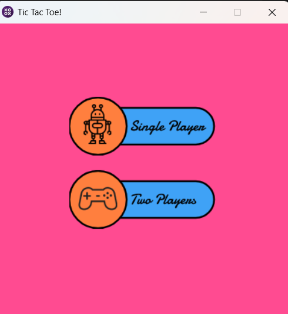
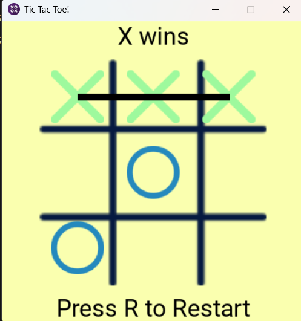
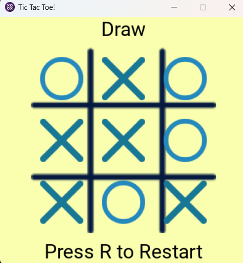

# 🎮 Tic Tac Toe – Pygame Edition (Unbeatable AI)

A stunning Tic Tac Toe game built with **Python** and **Pygame**, featuring both **single-player** and **multiplayer** modes. Play locally with friends or go head-to-head against an **unbeatable AI** powered by the **Minimax algorithm**!

<p align="center">
  <a href="https://www.python.org/"></a>
  <a href="https://www.pygame.org/"></a>
  <a href="#"></a>
  <a href="https://github.com/sudhanvapops/tictactoe"></a>
</p>

---

## 🧩 Features

- 🧠 **Unbeatable AI (Minimax Algorithm)** – perfect decision-making every time  
- 👥 **Two Game Modes**
  - **1P Mode:** Player vs AI  
  - **2P Mode:** Local multiplayer  
- 🎨 **Smooth Pygame UI** – includes animations, restart, and back navigation  
- ⚡ **Responsive & Fast** – runs at 60 FPS with clean event handling  
- 🔁 **Restart Anytime** – press `R` to restart, `B` to go back to menu  

---

## 🧠 How the AI Works

- The **Minimax algorithm** evaluates all possible board states to find the move that minimizes potential loss and maximizes gain.  
In simpler words:  
- You can **draw**, but you’ll **never beat it** 😎

---

## 🖼️ Screenshots

<p align="center">
  
  
  
</p>

- 🎮 Built with **Pygame** — featuring clean graphics, fluid motion, and unbeatable logic.

---

## 🚀 Getting Started

### 1️⃣ Clone the Repository
```bash
git clone https://github.com/sudhanvapops/06_Tic_Tac_Toe_GUI
cd 06_Tic_Tac_Toe_GUI
```

### 2️⃣ Install Dependencies

Make sure you have Python 3.10+ and Pygame installed:

```bash
pip install pygame
```

### 3️⃣ Run the Game

```bash
python main.py
```

---

## 📁 Project Structure

```

tictactoe/
├── main.py # Main game loop and event handling
├── Main_Game.py # Separate main game module (if used)
├── main_menu.py # Main menu logic
├── variables.py # Colors, states, and global variables
├── functions.py # UI logic, drawing, and utility functions
├── minimax.py # AI logic using Minimax
├── Button_Class.py # Custom button handling
├── sprite_class.py # Sprite and object management
├── Documents/ # Game screenshots and assets
├── assets/ # Additional assets
└── Readme.md # Project README
```

---

## ⌨️ Controls

| Key   | Action               |
| ----- | -------------------- |
| Mouse | Select a tile        |
| R     | Restart the game     |
| B     | Go back to main menu |
| Esc   | Quit                 |

---

## 🧠 Tech Stack

<p align="center">
  <a href="https://www.python.org/"></a>
  <a href="https://www.pygame.org/"></a>
  <a href="https://en.wikipedia.org/wiki/Minimax"></a>
</p>

---

## 🛠️ Future Enhancements

* 🖥️ Add main menu background animations
* 🔊 Sound effects for moves and wins
* 🌐 Online multiplayer mode
* 🧩 Difficulty levels for AI

---

## 🧾 License

This project is licensed under the [MIT License](LICENSE).

---

## 💖 Credits

Built with ❤️ by [**Sudhanva S**](https://github.com/sudhanvapops)

---